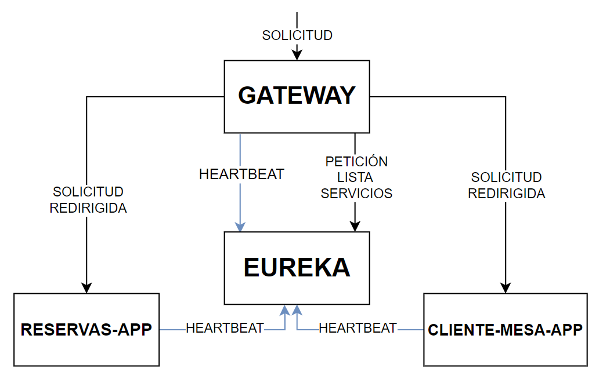

# Microservicios con Spring y Docker

Ecosistema de microservicios desarrollado con **Spring Cloud** y contenerizado con **Docker**. Se han seguido los principios SOLID, además de buenas prácticas de desarrollo, tales como: código limpio, manejo robusto de excepciones, manejo eficiente de dependencias en los contenedores, entre otras. El objetivo de este proyecto es demostrar dominio en el desarrollo de arquitecturas sólidas basadas en microservicios.

Estas aplicaciones se encuentran contenerizadas con Docker y están publicadas en el siguiente repositorio público: https://hub.docker.com/r/sebagq/microservicios-springcloud

El `docker-compose.yml` que se encuentra en el branch main puede usarse para cargar las imagenes desde ahí y ejecutar la aplicación fácilmente, en la sección **Cómo ejecutar** se encuentran los detalles.

> **Nota**: Este README no está terminado.

## Contenido

Cada microservicio está en su propia branch y cuenta con una documentación detallada. En ellos, se explican las buenas prácticas aplicadas y las razones por las que se tomó cada decisión. La documentación se puede encontrar en diversas capas de la aplicación, como en los `controllers`, `services`, `entities`, etc. También se documentan archivos clave de configuración como los `Dockerfile` o los `application.yml`.

### Microservicios Actuales

- **Eureka**: Servicio de descubrimiento.
- **Gateway**: Puerta de enlace para la comunicación.
- **Cliente-Mesa-APP**: API Rest.
- **Reservas-APP**: API Rest.

Los servicios `Cliente-Mesa-APP` y `Reservas-APP` son API Rest que funcionan en conjunto. En cambio, `Eureka` y `Gateway` son componentes clave del ecosistema Spring Cloud.

## Arquitectura proyecto

#### Manejo de solicitudes
El Gateway funciona como un punto de entrada a las solicitudes, es decir, todas las solicitudes se dirigirán al Gateway, y este las redireccionará al servicio correspondiente según nuestras configuraciones. Para saber hacia qué dirección debe dirigir las solicitudes le pide una lista de los servicios registrados a Eureka.

#### Descubrimiento de servicios
Eureka se encarga del descubrimiento de servicios, significa que registra la dirección actual de los servicios, y esto es necesario para que puedan comunicarse entre sí, por ello es que todos se registran en Eureka, y Eureka mediante comprobaciones de salud (heartbeats) verifica que los servicios se encuentren funcionando correctamente. Usando esta información se encarga además de repartir las solicitudes entre las diferentes instancias de los servicios (diciendole al gateway hacia qué instancia apuntar), por ejemplo si tengo 2 reserva-app funcionando y 1 de ellos está saturado entonces eureka se encargará de decirle al gateway que la solicitud se debe dirigir al que está libre.

#### Lógica de la aplicación
La aplicación consiste en un sistema de reserva de mesas para un restaurant, la lógica de negocio es bastante simple, permite añadir/editar/eliminar mesas y clientes, y  hacer reservas en base a ello. `reservas-app` y `cliente-mesa-app` son aplicaciónes que consisten en API Rest con CRUD de las entidades principales y métodos que permiten por ejemplo registrar mesas, hacer o cancelar reservas, etc.

Estas API se desarrollaron según las buenas prácticas de diseño y respetando los principios SOLID, esto se ve reflejado por ejemplo en:
- Se definen los nombres de variables, métodos, atributos y endpoints según las convenciones, lo que facilita la legibilidad y permite una rápida adaptación por parte de otros desarrolladores.
- Cada capa de la aplicación tiene una única responsabilidad y esto se respeta de manera estricta.
- Uso de DTO para evitar exposición de información y reducir la cantidad de datos en las solicitudes, lo que permite reducir tiempos de respuestas y costos.
- Métodos desarrollados cuidadosamente para mantener la legitibidad, separar responsabilidades y facilitar futuras modificaciones y nuevas funcionalidades.
- Uso de un Manejador Global de excepciones, apoyado de implementación de logs personalizados y un cuidadoso manejo de posibles excepciones para mejorar la depuración y robustez de la aplicación.
- Definición de un Dockerfile que permite que las dependencias se manejen en la etapa de construccion de la imagen, esto implica un uso eficiente de recursos a la hora de desplegar la aplicación.

## Cómo ejecutar

Para ejecutar la aplicación basta con ejecutar el `docker-compose.yml` que se encuentra en el branch main.
Para ejecutarlo debemos tener instalado Docker, y GIT.
1. Ir a algún directorio donde queramos descargar el `docker-compose.yml` .
2. Ejecutar en la terminal: **git clone -b main https://github.com/SebaGQ/microservicios-spring-docker.git**
3. Ir al directorio /microservicios-spring-docker que se acaba de crear  y ejecutar **docker-compose up** .
4. Esperar a que inicie la aplicación (puede demorar un poco en descargarse, depende del internet), es importante tener docker abierto.

## Pendientes

Hay ciertas funcionalidades y características que no se implementaron, como:

- Servicio de centralización de configuraciones.
- Seguridad con Oauth2.
- Herramientas de metricas y monitoreo.

Se decidió no implementar estas características de momento para no añadir complejidad innecesaria, ya que la finalidad de este proyecto es mostrar conocimiento sobre microservicios y buenas practicas. Tal vez se agreguen en el futuro.
